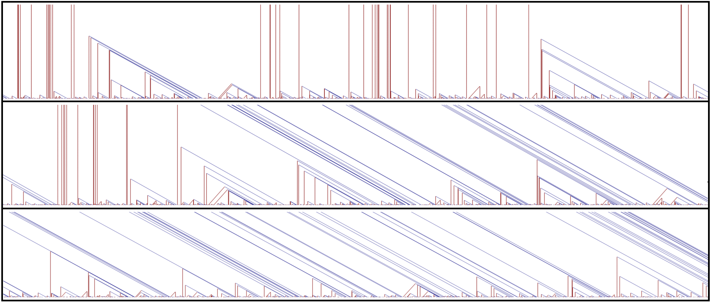

# Ballistic Annihilation
Repository for simulating various extensions of **Ballistic Annihilation**

  This repository contains the scripts that generate simulation figures reported in the paper:  

Matthew Junge and Hanbaek Lyu,\
*"The phase structure in asymmetric ballistic annihilation."* To appear in the Annals of Applied Probability (https://arxiv.org/abs/1811.08378) (arXiv 2021)

&nbsp;

